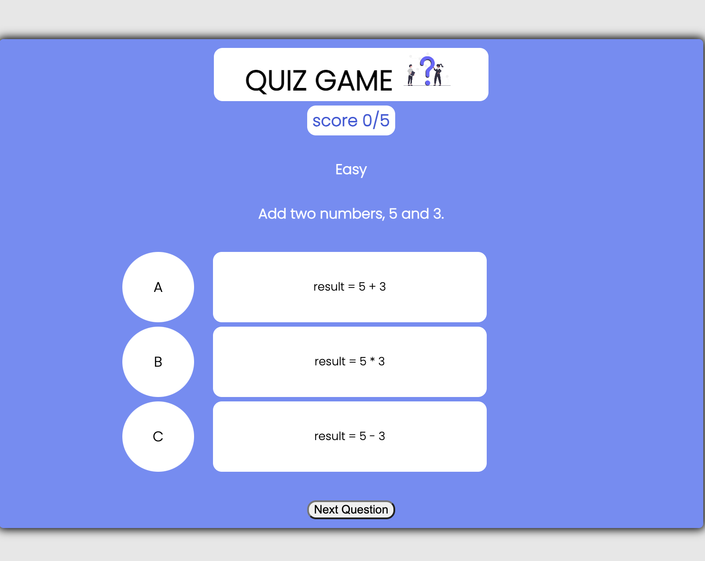
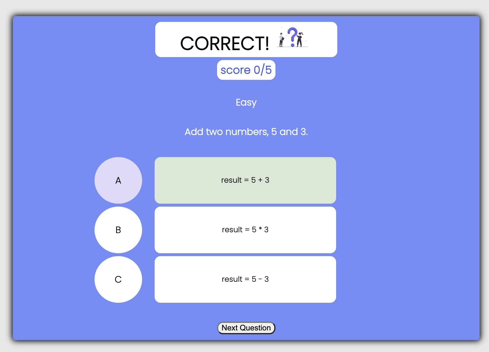
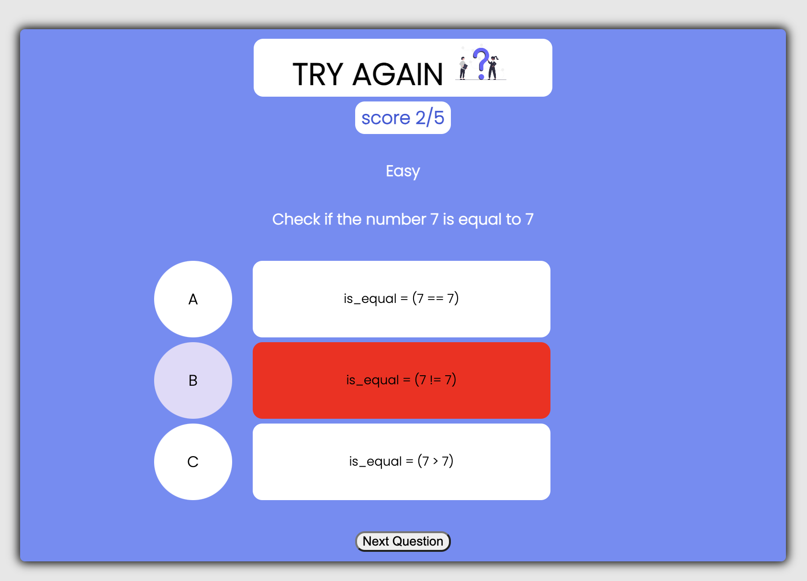
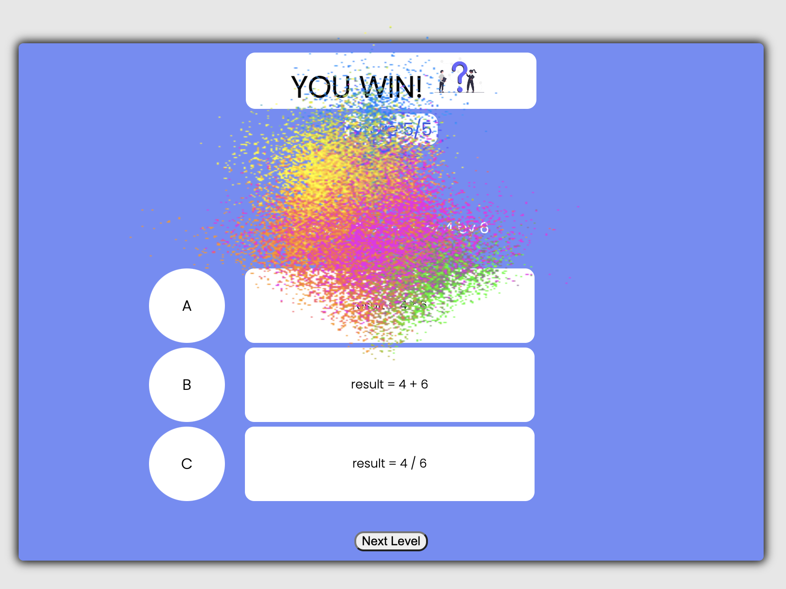
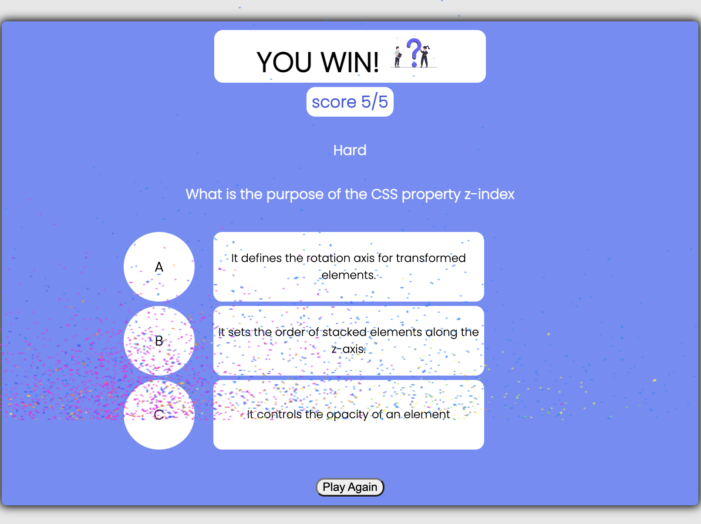

# QUIZ GAME

A quiz game with three different levels of multiple choice questions ranging from easy to medium to hard
each level has 5 questions with three answers the answered section will highlight green for correct and red for incorrect. The games question themes are coding based to test your basic knowledge of web development.

## Tech stack:

Java Script,
HTML,
CSS

## Getting Started:

QUIZ GAME link:
https://erinr123.github.io/Game-Projects/

There are 3 different levels,
each level has 5 question. to complete the game you answer all 15 questions correctly.

## Ice Box Items:

Additionally I would like to add the option for different genres and different styling of the web page for each individual genre selection.
